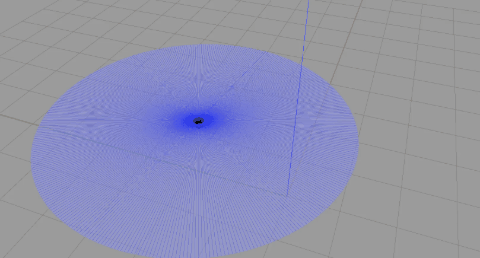
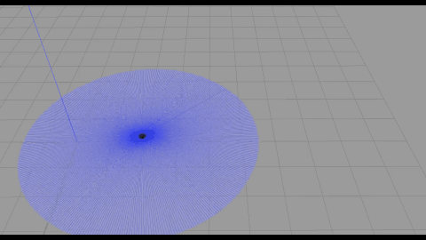

# robot_safety — 机器人安全监控与门控系统
## 一、项目简介
本项目是面向 TurtleBot3 / Gazebo 仿真平台的轻量级机器人安全防护栈，架构设计参考 ISO 13849 功能安全标准（第 5、6 章用于安全检测机制设计，第 10 章用于验证与确认测试）。
系统采用关注点分离（SoC）原则，划分为观测、裁决、强制执行三层架构：
    * 观测层（monitor）：以 10 Hz 周期发布 RobotState 状态快照，校验各话题时序有效性与底层物理量的合理性；
    *  裁决层（motion_safety）：实时监测线速度、角速度、加速度及差速运动学约束，仅负责超限识别与告警输出，不直接干预运动；
    * 门控层（safety_gate）：串接于 /cmd_vel 控制链路并强制执行裁决指令，遵循“只减不增”的失效安全（Fail-Safe）原则，仅执行三种确定性操作：原样放行、零速制动或指令丢弃/拒绝。

## 二、功能演示

超速保护（角速度）：当检测到指令或实际角速度超出设定阈值时，门控机制即刻触发并介入刹停。

超速保护（线速度）：当线速度超出标定安全范围或加速度突变时，系统自动切断速度输出并强制停机。

## 三、快速上手
1. 编译与环境配置

```Bash
cd ~/robot-safety
source /opt/ros/humble/setup.bash
colcon build --symlink-install && source install/setup.bash
```
2. 启动仿真与安全节点
```Bash
# 终端 A：启动 Gazebo 仿真环境
export TURTLEBOT3_MODEL=burger
ros2 launch turtlebot3_gazebo turtlebot3_world.launch.py

# 终端 B：启动安全系统（监控 + 裁决 + 门控）
ros2 launch robot_safety_monitor safety_gate.launch.py
```
3. 查看系统状态
```Bash
# 持续监听摘要信息（状态跳变时自动打印详细排查日志）
ros2 run robot_safety_monitor state_reporter

# 单次捕获全量系统快照
ros2 run robot_safety_monitor state_reporter --once -v
```